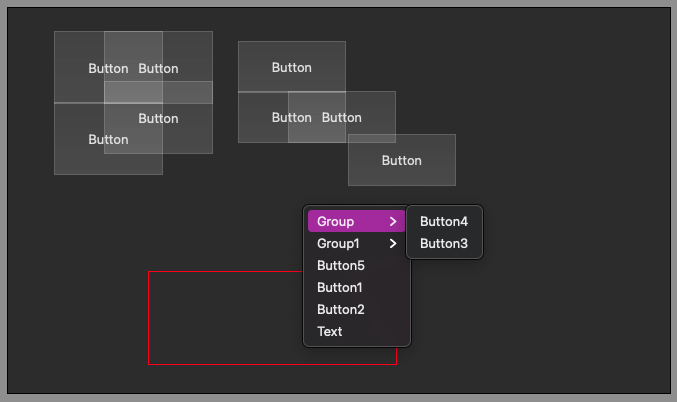

# SelectObject Form Macro

[![language][code-shield]][code-url]
[![language-top][code-top]][code-url]
![code-size][code-size]
[![license][license-shield]][license-url]
[![discord][discord-shield]][discord-url]

Display a menu to select an object by its name.

## Other components

<!-- MARKDOWN LINKS & IMAGES -->
<!-- https://www.markdownguide.org/basic-syntax/#reference-style-links -->
[code-shield]: https://img.shields.io/static/v1?label=language&message=4d&color=blue
[code-top]: https://img.shields.io/github/languages/top/mesopelagique/SelectObjectFormMacro.svg
[code-size]: https://img.shields.io/github/languages/code-size/mesopelagique/SelectObjectFormMacro.svg
[code-url]: https://developer.4d.com/
[license-shield]: https://img.shields.io/github/license/mesopelagique/SelectObjectFormMacro
[license-url]: LICENSE
[discord-shield]: https://img.shields.io/badge/chat-discord-7289DA?logo=discord&style=flat
[discord-url]: https://discord.gg/dVTqZHr
